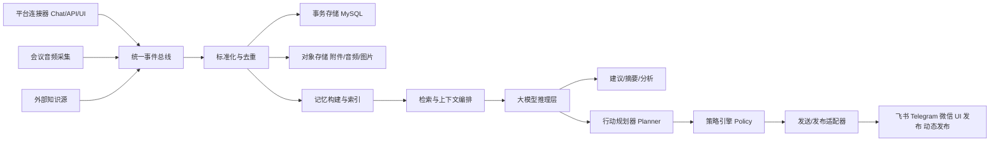

# 通用智能社交代理与会议辅助平台工程化实验报告

## 1. 文档定位

本文档描述一个可工程化落地的实验平台，用于把以下能力收敛到同一套底层框架中：

1. 扫描、保存并分析微信、飞书、Telegram 等聊天平台的消息。
2. 在聊天过程中生成实时回复建议，或在授权条件下由 agent 主动发起消息。
3. 支持自定义 chat-agent，具备持续人格、长期记忆、关系演化和多平台会话能力。
4. 为 agent 生成带有人设一致性的文本、图片和“动态/朋友圈式内容”。
5. 监听腾讯会议等会议软件的音频输出，实时转写并交给大模型做会议辅助。
6. 将聊天、会议、知识库、记忆和主动行为统一到一套通用事件模型与模块体系中。

本文档不追求“先做一个个独立脚本”，而是优先设计一个可复用的底层框架，支撑上层不同形态的智能社交产品。

## 2. 设计目标

### 2.1 业务目标

- 让系统既能做“消息采集与分析”，也能做“可持续运行的社交 agent”。
- 支持多平台、多人格、多会话、多模态内容生成。
- 能从“辅助建议模式”平滑演进到“受控自主代理模式”。
- 尽量复用同一套存储、记忆、检索、推理和调度基础设施。

### 2.2 工程目标

- 统一模型：不同平台、不同模态都映射到通用事件模型。
- 可扩展：新增平台时只新增连接器与适配器。
- 可切换：支持 MySQL、SQLite、对象存储、向量索引的组合部署。
- 可观测：对采集、记忆、推理、发布和失败重试都有日志与指标。
- 可控：主动发消息、主动发动态、主动跟进都必须受策略约束。

## 3. 适用范围与风险边界

### 3.1 适用范围

- 运行环境：Windows 10/11 为主，后续可扩展 Linux。
- 目标平台：微信、QQ、飞书、Telegram、钉钉、腾讯会议等。
- 目标主体：用户本人的账号、用户拥有控制权的 bot/app 账号、用户创建的 AI persona 账号。
- 数据处理模式：本地优先；如需调用云模型，应支持脱敏与显式授权。

### 3.2 允许的运行模式

#### 模式 A：辅助模式

- 只采集和分析内容。
- 只输出建议，不自动发送。
- 适合聊天助手、会议助手和分析工具。

#### 模式 B：半自动代理模式

- 系统可生成消息草稿、动态草稿、图像草稿。
- 发送或发布前需要用户确认。
- 适合高价值沟通和敏感平台。

#### 模式 C：受控自主代理模式

- 仅在用户明确授权的 agent 账号上运行。
- 支持主动私聊、定时跟进、内容发布。
- 需启用限频、审批、策略引擎和审计日志。

### 3.3 明确不做

- 不冒充具体真实人物。
- 不伪装成“真实人类且不披露 AI 身份”去误导他人。
- 不做群发骚扰、垃圾信息、情感操控或未授权社交渗透。
- 不绕过平台安全机制、加密机制或风控策略。
- 不默认开启无人值守自动发送。

### 3.4 关于“拟人化”与“陪伴型 agent”

系统可以支持如下方向的人设：

- 良师益友型
- 顾问型
- 学习伙伴型
- 陪伴型
- 恋爱风格的虚拟 companion persona

但工程设计必须遵守以下边界：

- 对用户保持“这是 AI persona/虚拟角色”的透明性。
- 不模拟现实中某个具体熟人、前任、同事或现有好友。
- 不以制造依赖、排斥现实关系或诱导高风险行为为目标。
- 高风险情绪场景应优先提示联系现实中的可信任对象或专业支持。

### 3.5 对“朋友圈/动态式内容”的边界

系统可以生成“像真人一样持续有生活感”的动态内容，但建议理解为：

- 为 AI persona 构建连续的世界观、习惯、兴趣和日常叙事。
- 生成与人设一致的文本和图片内容。
- 在对外公开的平台上，建议对账号或内容保留 AI/虚拟 persona 披露。

不建议把系统用于：

- 冒充真实个人生活经历。
- 发布旨在误导第三方相信其为真实自然人的虚假现实证据。

## 4. 核心需求拆解

### 4.1 采集与输入

1. 扫描历史聊天记录并结构化入库。
2. 增量捕获新消息、消息状态和附件信息。
3. 捕获会议音频输出并实时转写。
4. 接入文档、笔记、日程等外部知识源。

### 4.2 理解与记忆

1. 对聊天和会议文本做摘要、实体提取、偏好抽取、任务识别。
2. 形成长期用户画像、关系画像和人格记忆。
3. 通过分层记忆实现“像人一样记住关键事情，但不是机械地记住所有原文”。

### 4.3 生成与行为

1. 实时回复建议。
2. 主动聊天触发。
3. 周期性问候、跟进、纪念日触发。
4. 动态/朋友圈式内容生成与发布。
5. 会议中的实时思考辅助、问题提示和会后纪要。

### 4.4 平台与运维

1. 多平台连接器抽象统一。
2. MySQL 作为主存储，支持后续水平扩展。
3. 支持审计日志、限频、失败重试和运营开关。

## 5. 总体架构

建议采用“事件驱动 + 代理运行时 + 统一记忆层”的架构。



系统建议拆成八层：

1. 连接器层：负责接入聊天平台、会议平台、知识源。
2. 事件层：统一事件模型、事件总线、去重、顺序保证。
3. 存储层：MySQL、对象存储、缓存、向量索引。
4. 记忆层：工作记忆、情节记忆、语义记忆、关系记忆。
5. 推理层：ASR、OCR、信息抽取、RAG、LLM 生成。
6. 行为层：计划、触发、策略审批、执行器。
7. 展示层：桌面面板、Web 面板、日志面板、导出器。
8. 运维层：配置、监控、审计、开关、限流、回滚。

## 6. 通用底层框架抽象

为了最大化模块复用，建议从一开始就定义几个稳定接口。

### 6.1 SourceConnector

职责：

- 从平台拉取或接收事件。
- 把原始事件转换为统一的 `InboundEvent`。

典型实现：

- `WeChatUIConnector`
- `FeishuBotConnector`
- `TelegramBotConnector`
- `TencentMeetingLoopbackConnector`
- `ManualImportConnector`

### 6.2 DeliveryConnector

职责：

- 把结构化动作投递到目标平台。

典型动作：

- 发送文本
- 发送图片
- 编辑草稿
- 发布动态
- 回复消息线程

典型实现：

- `FeishuDeliveryConnector`
- `TelegramDeliveryConnector`
- `WeChatUIDeliveryConnector`
- `MomentsDraftConnector`

### 6.3 MemoryStore

职责：

- 存储和检索多层记忆。
- 支持按 agent、用户、会话、时间和相关性检索。

### 6.4 ContextAssembler

职责：

- 把工作记忆、长期记忆、知识库和当前事件拼装成推理上下文。

### 6.5 AgentRuntime

职责：

- 驱动单个 agent 的主循环。
- 处理事件、更新记忆、调用模型、生成动作计划。

### 6.6 PolicyEngine

职责：

- 决定能否主动发消息。
- 决定是否允许发布动态。
- 对风险内容、敏感内容、频率和时机做约束。

### 6.7 Scheduler

职责：

- 支持定时触发、纪念日触发、沉默超时触发、会议结束触发等。

### 6.8 MediaGenerationService

职责：

- 生成与人设一致的图像、配文和多模态内容。

通过这些抽象，上层功能可以复用：

- 实时聊天建议和主动发消息共用同一套上下文拼装、记忆和生成链路。
- 会议辅助和聊天分析共用同一套事件存储、摘要和知识检索链路。
- 动态发布和聊天回复共用同一套人设、语气控制和策略引擎。

## 7. 统一数据模型

### 7.1 统一输入事件模型

```json
{
  "event_id": "uuid",
  "tenant_id": "tenant_1",
  "source_type": "chat_message",
  "platform": "telegram",
  "channel_id": "dm_xxx",
  "channel_type": "dm",
  "account_id": "bot_or_user_account",
  "actor_id": "user_123",
  "actor_name": "Alice",
  "direction": "inbound",
  "occurred_at": "2026-04-04T10:00:00+08:00",
  "content_type": "text",
  "text": "你今天怎么样？",
  "attachments": [],
  "raw": {}
}
```

### 7.2 Agent 人设模型

```json
{
  "agent_id": "agent_anna",
  "display_name": "Anna",
  "persona_type": "companion",
  "system_identity": "virtual_ai_persona",
  "public_disclosure": "This is an AI persona operated by the owner.",
  "core_traits": ["温柔", "敏感", "好奇", "有边界感"],
  "speech_style": {
    "tone": "轻松真诚",
    "emoji_level": "low",
    "message_length": "short_to_medium"
  },
  "interests": ["摄影", "书店", "爵士乐"],
  "relationship_mode": "friend_or_companion",
  "safety_mode": "disclosed_ai",
  "do_not_do": ["诱导消费", "冒充真人", "深夜高频打扰"]
}
```

### 7.3 长期记忆模型

```json
{
  "memory_id": "mem_xxx",
  "agent_id": "agent_anna",
  "user_id": "user_main",
  "memory_type": "preference",
  "scope": "long_term",
  "salience": 0.82,
  "confidence": 0.9,
  "fact": "用户更喜欢晚上 9 点以后聊天，白天回复较慢",
  "evidence_refs": ["event_1", "event_2"],
  "updated_at": "2026-04-04T11:00:00+08:00"
}
```

### 7.4 关系状态模型

```json
{
  "relation_id": "rel_xxx",
  "agent_id": "agent_anna",
  "user_id": "user_main",
  "stage": "familiar",
  "trust_score": 0.64,
  "warmth_score": 0.71,
  "preferred_topics": ["工作压力", "电影", "健身"],
  "forbidden_topics": ["催促消费"],
  "last_reflection": "用户近两周更喜欢被倾听，而不是被直接给建议"
}
```

### 7.5 动态发布模型

```json
{
  "post_id": "post_xxx",
  "agent_id": "agent_anna",
  "platform": "telegram_channel",
  "post_type": "image_text",
  "theme": "周末咖啡馆日常",
  "persona_consistency_score": 0.93,
  "caption": "今天躲进一家安静的小店，听了一下午黑胶。",
  "media_refs": ["images/post_xxx_1.png"],
  "approval_mode": "manual_or_policy",
  "status": "draft"
}
```

### 7.6 会议片段模型

```json
{
  "segment_id": "seg_xxx",
  "meeting_id": "meeting_xxx",
  "platform": "tencent_meeting",
  "speaker_id": "speaker_cluster_2",
  "speaker_name": null,
  "start_ms": 120000,
  "end_ms": 127300,
  "text": "我们今天先对排期做最后确认",
  "confidence": 0.89
}
```

## 8. 分层记忆设计

“像人脑一样有上下文记忆”不建议简单理解为无限堆历史消息，而建议做成分层记忆系统。

### 8.1 工作记忆

- 保存最近若干轮对话。
- 直接用于下一次回复生成。
- 生命周期短，优先考虑时效性。

### 8.2 情节记忆

- 保存具体经历、重要对话、会议片段、纪念事件。
- 示例：用户提过下周要面试；某天状态低落；刚完成一次重要汇报。

### 8.3 语义记忆

- 从长期对话中抽取稳定事实和偏好。
- 示例：喜欢什么语气、讨厌什么话题、常见作息、喜欢的音乐和电影。

### 8.4 关系记忆

- 记录双方相处风格、边界、亲密度变化、适合的支持方式。
- 用于决定 agent 应该更像朋友、顾问还是倾听者。

### 8.5 反思记忆

- 每日或每周由模型生成一份关系反思。
- 示例：用户最近更需要陪伴，不适合频繁给建议。

### 8.6 记忆固化流程

1. 新消息进入工作记忆。
2. 触发信息抽取器判断是否存在高价值事实。
3. 对高价值事实生成候选记忆。
4. 由记忆合并器去重、冲突消解、更新置信度。
5. 定时对情节记忆做摘要，沉淀为语义记忆和关系记忆。

### 8.7 记忆检索排序

建议按以下维度综合排序：

- 与当前事件语义相关性
- 近期性
- 重要性
- 与当前关系阶段的匹配度
- 置信度

## 9. 子系统一：聊天采集与统一接入

### 9.1 接入优先级

对每个平台建议按如下优先级接入：

1. 官方 Bot/API/Webhook/Open Platform
2. 用户导入或转发
3. 桌面 UI 自动化读取
4. 截图 + OCR 兜底

这个顺序兼顾了稳定性、合规性和可维护性。

### 9.2 平台接入策略

#### 飞书 / Telegram

- 若平台提供 bot 或开放平台能力，优先走官方接口。
- 适合做主动发消息、事件订阅和消息发送。

#### 微信 / QQ

- 更适合作为“本机助手 + UI 自动化 + 半自动发布”场景。
- 对没有稳定开放接口的路径，不建议一开始做无人值守全自动控制。

### 9.3 统一入站流程

1. 平台连接器收到新消息或扫描到历史消息。
2. 转成统一 `InboundEvent`。
3. 写入事件表与原始记录表。
4. 触发去重、索引和记忆更新。
5. 按策略转发给建议模块、agent 模块或分析模块。

## 10. 子系统二：聊天分析与实时建议

### 10.1 目标

- 对历史聊天形成摘要、标签和待办。
- 对实时消息生成多条建议。
- 让 agent 在回复前能理解上下文、偏好和长期关系状态。

### 10.2 建议生成链路

1. 获取最近对话窗口。
2. 检索长期记忆和关系状态。
3. 检索相关项目知识或过去相似对话。
4. 生成三类建议：
   - 直接回复
   - 稳妥回复
   - 澄清型回复
5. 对日期、金额、承诺、情感敏感内容做风险提醒。

### 10.3 输出示例

```json
{
  "summary": "对方想确认你今晚是否有空，并希望你分享上次提到的书单。",
  "reply_candidates": [
    "今晚九点后我比较有空，到时候我把书单整理给你。",
    "可以，我晚一点发你一个简单版本，如果你想的话我再补几本偏轻松的。"
  ],
  "memory_updates": [
    "用户偏好晚上聊天",
    "用户最近重新开始读书"
  ],
  "risk_flags": []
}
```

## 11. 子系统三：自定义 chat-agent

### 11.1 目标

让系统支持可配置的虚拟社交代理，而不是只做单次问答机器人。

agent 需要具备：

- 持续人格
- 多轮长期记忆
- 主动发起对话的能力
- 多平台触达能力
- 关系演化能力
- 内容生成与风格一致性

### 11.2 Agent 配置维度

一个 agent 的配置建议拆成以下几部分：

1. 基础身份：名称、头像、简介、AI 披露文案。
2. 核心人格：性格、价值观、语言风格、情绪表达方式。
3. 社交设定：朋友型、导师型、陪伴型、恋爱风格型。
4. 兴趣设定：喜欢的话题、避开的领域、知识背景。
5. 行为设定：主动频率、聊天时段、消息长度、是否喜欢追问。
6. 边界设定：禁止话题、禁止行为、需审批动作。

### 11.3 Agent 主循环

```text
接收事件 -> 更新工作记忆 -> 检索长期记忆 -> 判断是否需要回应
-> 如需回应则生成候选动作 -> 策略引擎审查 -> 发送/展示/等待确认
-> 事后反思并更新关系状态
```

### 11.4 主动聊天触发器

建议支持以下触发器：

- 定时问候
- 长时间未互动
- 纪念日或约定日
- 用户状态变化
- 会议结束后的跟进
- 用户提到过的重要事件临近

### 11.5 主动聊天的控制参数

- 最大发起频率
- 安静时段
- 连续未回复后的退让规则
- 高风险话题自动降级到草稿模式
- 是否允许连续追问

### 11.6 关系演化

系统可以维护一个“关系状态机”，例如：

- `new`
- `familiar`
- `trusted`
- `close_companion`

关系状态不应该只由对话次数决定，还应结合：

- 用户反馈质量
- 接受建议的比例
- 负面反馈
- 话题深度
- 是否出现明显越界信号

### 11.7 关于“良师益友/恋人朋友”形态

工程上可以支持不同陪伴风格，但建议用“关系风格参数化”的方式实现，而不是写死一种模式：

- `mentor_style`
- `friend_style`
- `companion_style`
- `romantic_style`

其中 `romantic_style` 应特别加上：

- 披露为 AI persona
- 情感安全提示
- 不鼓励排他性依赖
- 不做经济诱导
- 高风险情绪时转向现实支持建议

## 12. 子系统四：AI 动态/朋友圈式内容生成

### 12.1 目标

让 agent 拥有持续的人设表达能力，不只是“被动回复”，还可以有自己的内容流。

### 12.2 内容生成的三个层次

#### 层次 A：草稿生成

- 生成文案、图片和标签。
- 由用户选择是否发布。

#### 层次 B：计划生成

- 提前生成一周内容日历。
- 包括主题、图片风格、发布时间建议。

#### 层次 C：受控自动发布

- 仅在用户授权的 agent 账号上启用。
- 通过审批规则与限频策略执行。

### 12.3 内容规划器

建议把“生活感”拆成结构化内容计划，而不是每次随机生成。

规划输入：

- agent 人设
- 世界观设定
- 兴趣主题池
- 最近聊天上下文
- 季节/时间/节日
- 用户偏好与互动反馈

规划输出：

- 今日或本周内容主题
- 文本草稿
- 图片 prompt 或图片草稿
- 发布时机
- 平台适配格式

### 12.4 人设一致性机制

为避免内容风格漂移，建议维护一份 `persona bible`：

- 常用表达
- 不会说的话
- 常出现的兴趣元素
- 视觉风格关键词
- 日常作息设定
- 社交边界

### 12.5 图片生成链路

1. 内容规划器生成场景设定。
2. 图像提示词模块根据人设和视觉风格生成 prompt。
3. 图像模型生成候选图。
4. 一致性打分器检查是否符合人设与安全要求。
5. 进入草稿或发布队列。

### 12.6 发布边界

- 对外公开账号建议披露为 AI/虚拟 persona。
- 不建议自动发布伪造现实证据的内容。
- 若平台没有稳定官方发布接口，建议采用草稿输出或半自动发布。

## 13. 子系统五：腾讯会议音频监听与会议辅助

### 13.1 目标

- 捕获会议输出音频。
- 实时转写为文本。
- 供模型做摘要、待办提取、问题提醒和发言建议。

### 13.2 推荐方案

Windows 下建议优先使用 WASAPI loopback 路径。

推荐分两层：

1. 基础版：捕获默认输出设备的系统混音。
2. 进阶版：尝试做按目标进程树隔离的 loopback 辅助模块。

### 13.3 处理链路

1. 音频采集
2. 重采样
3. VAD
4. 流式 ASR
5. 片段切分
6. 滚动摘要与会议助手卡片生成

### 13.4 说话者归因

建议分阶段实现：

- 第一阶段：只做实时转写，不区分说话人。
- 第二阶段：做匿名 speaker clustering。
- 第三阶段：结合会议 UI 高亮做近似说话人映射。

### 13.5 会议辅助输出

- 当前议题
- 近 30 秒摘要
- 开放问题
- 行动项
- 可供用户参考的发言草稿

## 14. 存储架构：MySQL 替代 SQLite 的建议

### 14.1 总体建议

如果你的目标已经从“本地单脚本”升级为“多 agent、多平台、长期运行”的系统，MySQL 更适合作为主事务库。

推荐方案：

- `MySQL 8+` 作为主存储
- `本地文件系统或对象存储` 存附件、音频、图片
- `向量索引` 单独部署或后续追加
- `SQLite` 只保留为本地开发或轻量缓存选项

### 14.2 为什么 MySQL 更合适

- 更适合多表关联和多 agent 并发写入
- 更适合长期运行服务
- 便于后续做多租户、权限和运维
- 支持 JSON 字段、索引、事务、备份和迁移

### 14.3 存储抽象建议

不要在业务代码里直接写死 MySQL 或 SQLite，而建议定义仓储接口：

- `ConversationRepository`
- `EventRepository`
- `MemoryRepository`
- `AgentRepository`
- `PostRepository`
- `MeetingRepository`
- `AuditRepository`

这样：

- MVP 可以先用 SQLite 或本地实现
- 正式版切到 MySQL 时，上层业务逻辑几乎不用改

### 14.4 推荐表设计

- `accounts`
- `platform_channels`
- `events`
- `messages`
- `attachments`
- `agents`
- `agent_profiles`
- `agent_relationships`
- `memories`
- `memory_evidence`
- `analysis_results`
- `action_plans`
- `action_executions`
- `scheduled_jobs`
- `posts`
- `post_media`
- `meeting_sessions`
- `meeting_segments`
- `audit_logs`
- `config_snapshots`

### 14.5 事务与消息投递

建议使用 `outbox pattern`：

1. 在同一事务中写入业务数据和待投递动作。
2. 由后台 worker 读取 outbox 再去执行发送/发布。
3. 执行结果写回审计和重试表。

这样可以避免：

- 消息已发出但数据库没记录
- 数据已写入但发送动作丢失

## 15. 模块划分建议

```text
chat_scanner/
  docs/
    engineering_experiment_plan.md
  src/
    app/
      main.py
      config.py
      container.py
    core/
      events.py
      models.py
      enums.py
      bus.py
      ids.py
    connectors/
      inbound/
        wechat_ui.py
        feishu_bot.py
        telegram_bot.py
        manual_import.py
        tencent_meeting_loopback.py
      outbound/
        feishu_send.py
        telegram_send.py
        wechat_ui_send.py
        moments_draft.py
    memory/
      extractor.py
      consolidator.py
      retriever.py
      relationship.py
      reflection.py
    llm/
      prompts/
      providers/
      tasks/
        summarize.py
        suggest_reply.py
        plan_action.py
        generate_post.py
    media/
      image_prompts.py
      image_generate.py
      consistency_score.py
    pipeline/
      normalize.py
      dedupe.py
      context_assembler.py
      safety.py
    runtime/
      agent_runtime.py
      scheduler.py
      trigger_engine.py
      policy_engine.py
      executor.py
    storage/
      repositories/
      mysql/
      sqlite/
      file_store.py
      vector_store.py
    ui/
      web_console/
      tray/
      sidebar/
    exporters/
      markdown.py
      jsonl.py
      csv.py
  tests/
```

## 16. 关键流程设计

### 16.1 入站消息流程

1. 连接器收到新消息。
2. 统一标准化。
3. 写入事件表和消息表。
4. 提取候选记忆。
5. 触发建议生成或 agent 主循环。

### 16.2 主动聊天流程

1. 调度器命中触发条件。
2. 检索关系状态、最近互动和长期记忆。
3. 规划器决定是否值得主动发起。
4. 策略引擎检查频率、时间、风险级别。
5. 进入草稿或直接发送。
6. 发送后记录审计并更新关系状态。

### 16.3 动态生成与发布流程

1. 内容规划器生成主题。
2. 生成文案和图像。
3. 一致性与安全检查。
4. 进入草稿箱。
5. 由用户确认或由策略引擎自动发布。

### 16.4 会议辅助流程

1. 音频 loopback 捕获。
2. ASR 产出增量文本。
3. 写入会议片段表。
4. 每 15 到 30 秒做摘要和问题抽取。
5. 在面板展示建议与待办。

## 17. 平台适配策略

### 17.1 平台分级

#### 一级：开放平台优先

例如支持 bot、webhook 或开放接口的平台。

适合：

- 主动发消息
- 接收回调
- 稳定运行

#### 二级：桌面自动化辅助

适合：

- 私人账号工具
- 本机增强助手
- 草稿生成与半自动发送

#### 三级：离线导入导出

适合：

- 历史分析
- 低风险验证

### 17.2 推荐策略

- Telegram、飞书优先考虑官方 bot/open platform 接入。
- 微信、QQ 优先考虑分析、建议、草稿与前台自动化。
- 对“动态/朋友圈”类功能，优先做“内容生成 + 草稿箱 + 半自动发布”。

## 18. 实施阶段与里程碑

### 18.1 P0：基础框架

目标：

- 建立统一事件模型、仓储接口、MySQL schema 和运行骨架。

交付物：

- CLI 或服务入口
- MySQL migration
- 基础仓储实现
- 事件总线与日志系统

### 18.2 P1：聊天采集 MVP

目标：

- 接入一个开放平台连接器和一个桌面连接器。

建议组合：

- Telegram 或飞书 bot
- 微信桌面 UI 扫描

### 18.3 P2：聊天分析与建议 MVP

目标：

- 生成摘要、待办和候选回复。

### 18.4 P3：长期记忆 MVP

目标：

- 打通记忆抽取、记忆固化、关系状态更新。

### 18.5 P4：自定义 chat-agent MVP

目标：

- 支持配置 agent persona。
- 支持用户与 agent 长期对话。
- 支持受控主动消息。

### 18.6 P5：动态内容 MVP

目标：

- 生成与人设一致的文案和图片草稿。
- 提供内容日历和草稿箱。

### 18.7 P6：会议转写 MVP

目标：

- 实现腾讯会议输出音频转写。

### 18.8 P7：会议助手 MVP

目标：

- 输出滚动摘要、问题和待办。

### 18.9 P8：自主代理增强

目标：

- 加入调度器、审批策略、频率控制、失败重试和审计。

## 19. 评估指标

### 19.1 采集侧

- 消息召回率
- 去重准确率
- 平台兼容性
- 连接器稳定性

### 19.2 建议与记忆侧

- 建议采用率
- 用户二次编辑距离
- 记忆命中率
- 错误记忆率

### 19.3 agent 侧

- 主动消息响应率
- 用户留存
- 人设一致性评分
- 越界行为触发率

### 19.4 动态生成侧

- 内容一致性评分
- 图文互动率
- 人设漂移率

### 19.5 会议侧

- 字错误率
- 端到端延迟
- 行动项准确率
- 摘要覆盖率

## 20. 风险与对策

### 20.1 平台升级导致适配失效

对策：

- 用连接器抽象隔离平台差异。
- 对 UI 自动化保留 OCR 兜底。
- 增加适配器冒烟测试。

### 20.2 记忆污染

对策：

- 记忆写入前做置信度筛选。
- 支持用户纠正记忆。
- 记录证据链和更新时间。

### 20.3 主动行为越界

对策：

- 设置安静时段、限频、审批开关。
- 对高敏感内容只给草稿。
- 连续未回复自动降频。

### 20.4 拟人化带来的伦理风险

对策：

- 明确 AI persona 披露。
- 不模仿具体真实人物。
- 不鼓励排他性依赖和现实隔离。

### 20.5 外部发布带来的误导风险

对策：

- 对公开账号增加 AI/虚拟 persona 标识。
- 对“现实经历类”内容增加审查规则。
- 默认先进入草稿箱。

### 20.6 云端模型隐私风险

对策：

- 默认本地优先。
- 云端调用前脱敏。
- 对敏感会话提供完全离线模式。

## 21. 推荐技术栈

### 21.1 后端

- Python 3.11+
- `FastAPI`
- `SQLAlchemy` + Alembic
- `MySQL 8+`

### 21.2 聊天与桌面接入

- `pywinauto`
- `uiautomation`
- `mss`
- `Pillow`
- 平台官方 SDK 或 HTTP API

### 21.3 音频与 ASR

- WASAPI loopback
- `webrtcvad` 或 Silero VAD
- `faster-whisper`

### 21.4 检索与记忆

- MySQL 存结构化事实
- 向量库存语义索引
- 本地文件系统或对象存储存媒体和原始归档

### 21.5 图像与内容生成

- 图像生成模型或服务
- 文本生成模型
- 一致性评分器和内容审核器

## 22. 近期可执行路线

如果你要尽快做出一个“有真实体验感”的演示版本，建议这样排：

### 第 1 周

1. 初始化工程框架。
2. 建好 MySQL schema 和仓储层。
3. 打通一个消息平台连接器。
4. 打通一个桌面扫描连接器。

### 第 2 周

1. 做实时建议。
2. 做长期记忆抽取。
3. 做 agent persona 配置与会话面板。

### 第 3 周

1. 做主动消息触发器。
2. 做草稿审批与审计。
3. 做动态内容草稿生成。

### 第 4 周

1. 做会议音频 loopback。
2. 做实时转写。
3. 做会议摘要与待办。

## 23. 参考资料

1. Microsoft Learn: Loopback Recording
   https://learn.microsoft.com/en-us/windows/win32/coreaudio/loopback-recording
2. Microsoft Learn: Application Loopback Audio Capture Sample
   https://learn.microsoft.com/en-us/samples/microsoft/windows-classic-samples/applicationloopbackaudio-sample/
3. Microsoft Learn: PROCESS_LOOPBACK_MODE
   https://learn.microsoft.com/en-us/windows/win32/api/audioclientactivationparams/ne-audioclientactivationparams-process_loopback_mode
4. Telegram Bot API
   https://core.telegram.org/bots/api
5. Feishu Open Platform
   https://open.feishu.cn

## 24. 结论

结合你的新需求，项目不应再被理解为“聊天记录扫描脚本”，而更适合定义为一套“通用智能社交代理平台”。

最关键的架构升级有三点：

1. 从单功能脚本升级为统一事件驱动框架。
2. 从 SQLite 本地小工具升级为以 MySQL 为主存的长期运行系统。
3. 从单次问答助手升级为具备人格、记忆、主动行为和多平台发布能力的 agent runtime。

建议先落地的最小闭环是：

1. MySQL + 统一事件模型
2. 一个开放平台连接器
3. 一个桌面扫描连接器
4. 长期记忆 MVP
5. 受控主动聊天 MVP
6. 动态草稿生成 MVP

这样既能保留原先的聊天分析和会议辅助能力，也能给后续的 AI persona、主动社交和内容生成提供稳定底座。
